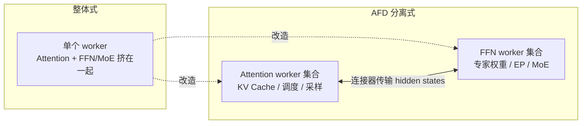
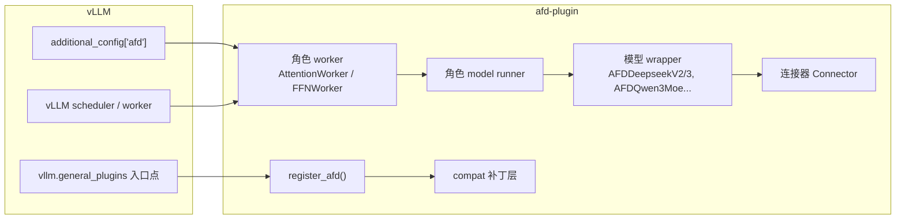
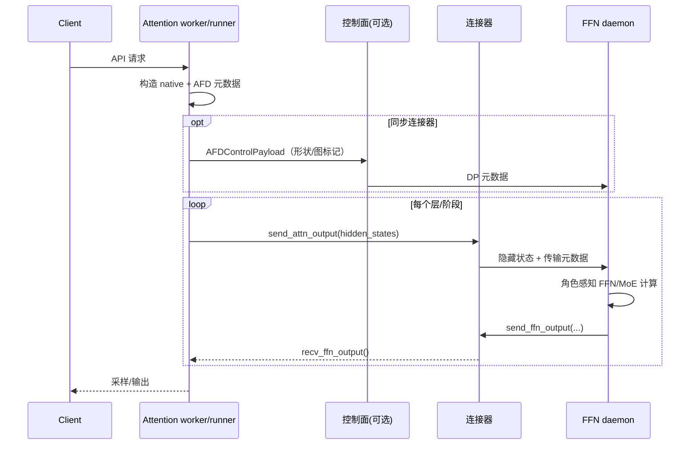

# AFD 分离（Attention-FFN Disaggregation）说明

> 本文基于 `afd-plugin` 仓库当前实现与设计文档整理，作为 AFD 概念的入门解释。
> 详细设计见 [`docs/design/module/index.md`](design/module/index.md) 及其子文档。

---

## 1. 一句话概括

**AFD（Attention-FFN Disaggregation，注意力-前馈网络分离）** 是一种 MoE 大模型推理架构：
把 Transformer 里 **Attention（注意力）** 和 **FFN（前馈/MoE 专家）** 两段计算，分别部署到
**独立的 worker 进程/设备集合** 上，通过 **后端连接器（connector）** 在两段之间传输
隐藏状态，从而让两段可以**独立扩缩容、独立调度、独立做缓存与并行**。

它是 **vLLM 的外部插件**（不修改 vLLM 源码），通过 vLLM 的插件机制接入，
当前目标运行时是 **vLLM `0.26.0`**，支持 **CUDA（GPU）** 与 **Ascend NPU**。

---

## 2. 为什么需要 AFD（动机）

在传统的整体式（monolithic）MoE 推理中，一个 worker 进程要同时承担：

- **Attention**：prefill/decode 计算、KV Cache、采样等；
- **FFN/MoE**：top-k 路由、专家计算（通常占显存的大头）、专家并行（EP）。

这带来几个问题：

| 问题 | 说明 |
| --- | --- |
| 显存互相挤压 | Attention 的 KV Cache 和 FFN 的专家权重挤在同一块显存里，互相争抢。 |
| 扩缩容不灵活 | 计算瓶颈在 Attention（prefill）或 FFN（decode）时，只能整体扩容，无法单独加 Attention 或 FFN 设备。 |
| 两段调度耦合 | prefill 与 decode 阶段的瓶颈不同，整体式难以分别优化。 |

**AFD 的思路**：把 Attention 和 FFN 拆到不同的 worker 集合上，各自独立优化：

- Attention 集合专注 **长上下文、KV Cache、prefill/decode 调度**；
- FFN 集合专注 **专家权重、EP 并行、MoE 计算**；
- 两者通过连接器按层（layer）交接隐藏状态。



---

## 3. AFD 的受益点

把 Attention 和 FFN 拆开后，主要能获得以下价值：

| 受益点 | 说明 |
| --- | --- |
| **显存解耦** | KV Cache 与专家权重不再挤在同一块显存。FFN 进程不持有 KV Cache（空 KV-cache spec），显存可全部投入专家权重与通信 buffer；Attention 进程显存专注 KV Cache 与长上下文。 |
| **独立扩缩容** | 瓶颈在 prefill/decode（Attention）就只加 Attention 设备；瓶颈在 decode/MoE（FFN）就只加 FFN 设备。可灵活配置 A/F 比例（如 `4A2F`、`48A16F`、`64A16F`），不必整体复制整份模型。 |
| **独立并行拓扑** | Attention 侧用 DP/TP（甚至 SP），FFN 侧用 EP，两段各自选择并行策略，不被整体式的单一并行方案绑死（如 CAM async 的 DP+TP/SP + EP 组合）。 |
| **独立调度与重叠** | Attention 走 vLLM 调度器处理请求，FFN 走 daemon 循环只做计算；异步路径（`CAMAsyncAFDConnector`）可以把 Attention 发送与 FFN 接收 pipeline 起来，隐藏部分跨段通信延迟。 |
| **部署与排障隔离** | 两段是独立进程/设备集合，可分别设置显存利用率、环境变量（如 `HCCL_BUFFSIZE`）、更新与重启；单段问题不需要重启整套推理服务。 |
| **资源投入更精准** | 资源可以精确投放到瓶颈段，避免"整体扩容"带来的算力/显存浪费。 |

### 代价与边界（需要客观看待）

AFD 不是免费的，收益依赖拓扑、上下文长度与负载：

- **引入跨进程/跨节点的通信开销**：hidden states 要通过连接器（NCCL / HCCL / CAM）在
  Attention 与 FFN 之间传输，消耗带宽并引入延迟；拓扑划分不当可能得不偿失。
- **性能并非总是正收益**。以 `CAMP2pAFDConnector` DeepSeek-V3.2 实测（EP64 为基线，
  tokens/s/die）为例：

  | 场景 | 48A16F | 64A16F |
  | --- | --- | --- |
  | 16K 固定输入 | **-5.3%** | **+11.3%** |
  | 32K 固定输入 | **-10.0%** | **+9.0%** |

  > 同一份权重下，64A16F 相对 EP64 基线是正收益，48A16F 却是负收益——说明 AFD 的价值
  > 主要在于**架构灵活性与显存解耦**，性能收益要按具体拓扑和负载评估。

- **部署复杂度上升**：需要连接器、控制面、角色编排，并要求全节点版本严格对齐
  （vLLM `0.26.0` + vLLM-Ascend 指定 commit + 配套 CANN/torch_npu）。

---

## 4. 核心思想与角色划分

AFD 把推理进程分成两个 **角色（role）**，每个角色只加载自己需要的模型组件：

| 角色 | 职责 | 加载的模型组件 | 对外行为 |
| --- | --- | --- | --- |
| **Attention（A）** | 对外 API、调度器执行、KV Cache、采样输出、AFD 元数据装配、向 FFN 交接 | Attention 各层 + 共享的 embedding / norm / output 组件 | 接收客户端请求 |
| **FFN（F）** | 纯计算 daemon：接收 Attention 传来的隐藏状态，做 MoE/FFN 计算后返回 | FFN/专家（expert）相关组件 | 不接收请求，只响应 Attention |

关键点：

- **请求只发给 Attention 进程**；FFN 进程是一个后台 daemon 循环，不做 KV Cache、
  不参与调度、也没有请求 KV 块（返回空的 KV-cache spec，warmup 返回 `0.0`）。
- 两个角色可以 **不同数量、不同拓扑**（如 `4A2F`：4 个 Attention 集合、2 个 FFN 集合）。
- 每个角色的模型 runner / worker 都是 AFD 插件自己实现并注册进 vLLM 的，
  通过配置 `worker_cls="auto"` 自动选择。

### 角色级启动示例（以 CAMP2P / NPU 为例）

```bash
# Attention 进程
VLLM_PLUGINS=ascend,afd vllm serve <model> \
  --additional-config '{"afd":{"role":"attention","connector":"CAMP2pAFDConnector",\
    "host":"127.0.0.1","port":1239,"num_attention_ranks":1,"num_ffn_ranks":1}}'

# FFN 进程（不接收请求）
VLLM_PLUGINS=ascend,afd vllm serve <model> \
  --additional-config '{"afd":{"role":"ffn","connector":"CAMP2pAFDConnector",\
    "host":"127.0.0.1","port":1239,"num_attention_ranks":1,"num_ffn_ranks":1}}'
```

> AFD 没有新增 CLI 参数；通过 vLLM 的 `--additional-config` 里的 `afd` 命名空间启用。
> 命名空间存在即激活 AFD，缺省为不启用。

---

## 5. 架构总览：插件化接入

AFD 不改动 vLLM 源码树，而是通过插件机制注入行为：

1. **入口点注册**：`pyproject.toml` 里声明 `vllm.general_plugins` 入口点
   `afd = "afd_plugin:register_afd"`，`register_afd()` 负责注册兼容补丁、模型映射等。
2. **配置通道**：`VllmConfig.additional_config["afd"]`。
3. **角色 worker / model runner / model wrapper**：插件自有实现，覆盖 vLLM 对应路径。
4. **窄版本兼容层**：`afd_plugin/compat/` 下的兼容补丁（`# ### PATCH START/END` 标记）。



---

## 6. 一次请求的数据流

以同步连接器（`P2pNcclAFDConnector` / `CAMP2pAFDConnector`）为例：

```text
客户端请求
  -> vLLM scheduler + Attention worker
  -> AFD Attention model runner 构造 native 输入/AFD 元数据
  -> 通过控制面（AFDControlPlane）把 DP 元数据发给 FFN
  -> 模型逐层执行 Attention
  -> Attention 通过连接器把 hidden states 发给 FFN
  -> FFN 做 MoE/FFN 计算后返回结果
  -> Attention 用返回的 hidden states 继续后续层
  -> vLLM 原生采样/输出
```



要点：

- **同步连接器**：Attention 先发、FFN 收 → 算 → 回传，Attention 收；控制面（DP 元数据）
  先行，用来让 FFN 推导 tensor 形状与图缓冲。
- **异步连接器（CAMAsync）**：不使用控制面，路由/token 元数据随 CAM dispatch 载荷一起走，
  FFN 侧以 daemon 循环阻塞在连接器工作项上；Attention 的 FFN 接收尽量推迟到下一层，实现 overlap。

---

## 7. 连接器（Connector）

连接器是角色之间的 **传输/契约层**，按后端分目录：

- `afd_plugin/connectors/gpu/` — GPU 连接器
- `afd_plugin/connectors/npu/` — NPU 连接器

| 连接器 | 平台 | 同步/异步 | 图支持 | 说明 |
| --- | --- | --- | --- | --- |
| `P2pNcclAFDConnector` | CUDA | 同步 | `FULL_DECODE_ONLY` CUDA Graph | FFN rank 排在 Attention 之前；要求 `num_attention_ranks >= num_ffn_ranks` 且整除。 |
| `CAMP2pAFDConnector` | Ascend NPU | 同步 | `FULL_DECODE_ONLY` ACL Graph | 基于 HCCL/CAMP2P 自定义算子；每个 batch/ubatch 建一个 HCCL AFD 组，另有 FFN-only HCCL 组与 Gloo 元数据组。 |
| `CAMAsyncAFDConnector` | Ascend NPU | 异步 | 不支持 | Attention rank 在前；支持 prefill/decode；不支 native DBO/PCP。 |

连接器共同接口（`AFDConnectorBase`）：

- `init_afd_connector()` — 建后端通信组/算子注册（Attention 在 `load_model()` 末尾、
  FFN 在 `initialize_from_config()`，两角色权重加载可重叠）；
- `send_attn_output()` / `recv_ffn_output()`（Attention 侧）；
- `recv_attn_output()` / `send_ffn_output()`（FFN 侧）；
- `control_plane` — 同步连接器安装控制面对象；`CAMAsyncAFDConnector` 为 `None`。

**拓扑与 rank 顺序**：

```text
P2P / CAMP2P（同步）：   world rank = [F0, F1, ..., A0, A1, ...]   （FFN 在前）
CAMAsync（异步）：       world rank = [A0, A1, ..., F0, F1, ...]   （Attention 在前）
```

---

## 8. 模型集成（Model Wrapper）

AFD 通过插件自有的模型 wrapper 实现 **角色感知（role-aware）** 加载与执行：

| 模型家族 | 注册架构 | AFD wrapper | 说明 |
| --- | --- | --- | --- |
| DeepSeek V2 / V3 / V3.2 | `DeepseekV2ForCausalLM`、`DeepseekV3ForCausalLM`、`DeepseekV32ForCausalLM` 等 | `AFDDeepseekV2ForCausalLM`、`AFDDeepseekV3ForCausalLM` | V3.2 复用 `AFDDeepseekV3ForCausalLM`。 |
| Qwen3 MoE | `Qwen3MoeForCausalLM` | `AFDQwen3MoeForCausalLM` | CUDA，`compute_gate_on_attention=false`。 |
| Qwen3.5 / 3.6 MoE | `Qwen3_5MoeForConditionalGeneration` | `AFDQwen3_5MoeForConditionalGeneration` | 目前仅 CUDA 文本链路有 E2E 证据。 |

每个 AFD 角色只构造并加载本角色需要的模型组件；共享的 embedding / norm / output
组件按模型生命周期需要保留。

**gate 放哪边**（`compute_gate_on_attention`）：

- CUDA P2P：两种都支持（gate 放在 Attention 或 FFN）；
- CAMP2P（NPU 同步）：目前必须为 `false`（gate 在 FFN）；
- CAMAsync（NPU 异步）：必须为 `true`（Attention 计算 MoE 路由数据，与 dispatch 一起发送）。

---

## 9. 关键机制：ubatch / DBO 与图执行

### Native DBO（Dual Batch Overlap）

- vLLM 原生 DBO 把一个大 batch 拆成两个 **ubatch**，让两个 ubatch 的计算/通信重叠。
- AFD 当前 **只支持恰好两个 ubatch**（`--ubatch-size 2`）。
- CAMP2P 在 DBO 开启时为**每个 ubatch 各建一个独立的 HCCL AFD 组**，避免两个 ubatch
  的传输互相干扰；Attention 通过各自 ubatch 的组接收 FFN 结果。
- Attention 与 FFN 必须使用相同的 DBO 开关、ubatch 数量与阈值。

### 图执行

- **CUDA**：支持 `FULL_DECODE_ONLY` CUDA Graph（仅 decode）。
- **NPU**：同步路径支持 `FULL_DECODE_ONLY` ACL Graph；异步 CAMAsync 不支持图、只能 eager。

### 控制面与图捕获

图 warmup/捕获期间，Attention 会通过控制面标记 `is_warmup` / `is_graph_capturing`，
让 FFN daemon 预热或捕获对应的形状。

---

## 10. 平台支持矩阵（现状）

| 能力 | CUDA（GPU） | Ascend NPU |
| --- | --- | --- |
| 连接器 | `P2pNcclAFDConnector` | `CAMP2pAFDConnector`（同步）、`CAMAsyncAFDConnector`（异步） |
| 数据面后端 | NCCL + Gloo 控制面 | HCCL/CAMP2P + Gloo 控制面；CAM async 走 CAM dispatch |
| 图支持 | `FULL_DECODE_ONLY` CUDA Graph | 同步 `FULL_DECODE_ONLY` ACL Graph；异步 eager only |
| 模型 | DeepSeek V2/V3/V3.2、Qwen3 MoE、Qwen3.5/3.6 | DeepSeek V3.2（已验证）；Qwen3 MoE 暂不支持 NPU |
| 运行时基线 | vLLM `0.26.0` | vLLM `0.26.0` + vLLM-Ascend commit `80d8c194f` + 配套 CANN/torch_npu |

---

## 11. 已知限制（Known Gaps）

- 只支持 vLLM `0.26.0`；不支持 vLLM model runner v2。
- Native DBO 只支持 **恰好两个 ubatch**；`CAMAsyncAFDConnector` 不支持 native DBO。
- PCP-based NPU model-runner-v1（来自 v0.19.1rc1）在 v0.26 上不支持。
- CUDA Graph 仅 `FULL_DECODE_ONLY`。
- Qwen3 MoE：不支持 Attention 侧 gate、SP MoE、EPLB、PP、投机解码、LoRA 与 NPU。
- Qwen3.5/3.6：仅 CUDA 文本链路，NPU/多模态不支持，gate-on-attention=true / PP / 异步 /
  多节点未支持。
- GPU/NPU E2E 测试需要真实硬件 + 模型权重，默认 opt-in。

---

## 12. 相关文档

- 设计文档入口：[`docs/design/module/index.md`](design/module/index.md)（含阅读顺序）
- 插件边界：[`plugin_boundary.md`](design/module/plugin_boundary.md)
- Attention 运行时：[`attention_runtime.md`](design/module/attention_runtime.md)
- FFN 运行时：[`ffn_runtime.md`](design/module/ffn_runtime.md)
- 连接器契约：[`connector_contracts.md`](design/module/connector_contracts.md)
- 模型集成：[`model_integration.md`](design/module/model_integration.md)
- 执行平台：[`execution_platforms.md`](design/module/execution_platforms.md)
- 兼容与补丁：[`compatibility_and_patches.md`](design/module/compatibility_and_patches.md)
- 用户指南：GPU [`NCCL_P2P_CONNECTOR_USER_GUIDE.md`](../gpu/NCCL_P2P_CONNECTOR_USER_GUIDE.md)；
  NPU [`CAM_P2P_CONNECTOR_USER_GUIDE.md`](../npu/CAM_P2P_CONNECTOR_USER_GUIDE.md)、
  [`CAM_ASYNC_CONNECTOR_USER_GUIDE.md`](../npu/CAM_ASYNC_CONNECTOR_USER_GUIDE.md)
- NPU 排障：[`docs/npu/TROUBLESHOOTING.md`](../npu/TROUBLESHOOTING.md)
- 部署/基准示例：[`recipe/README.md`](../../recipe/README.md)
